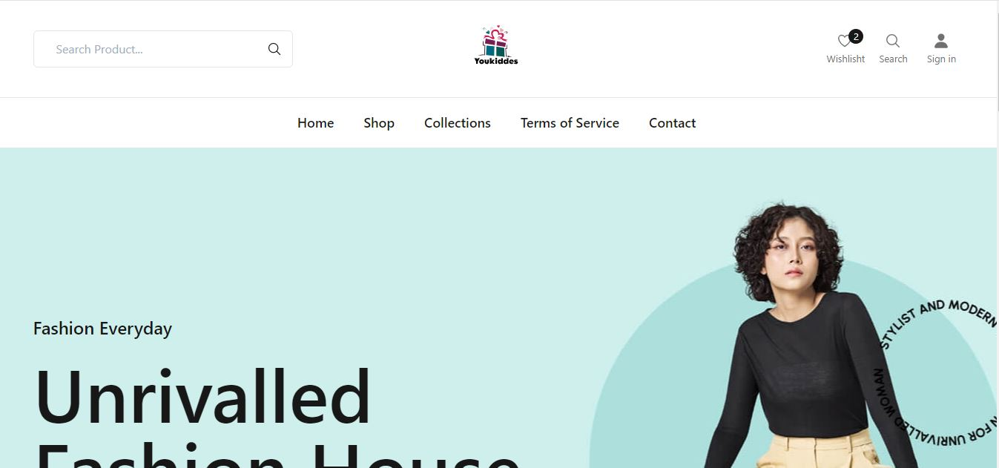

# E-Commerce Web Application Django
The E-Commerce Web Application is a Django-based platform designed to provide a seamless online shopping experience. 
The application features a user-friendly interface, efficient product management, and dynamic content rendering, making it an ideal solution for an online gift shop.

## Overview 


## Features

### 1. Product Management
- **Product Listing**: Display a list of all available products with essential details such as name, price, and image.
- **Product Details**: View detailed information about a specific product, including a high-resolution image, description, and price.
- **Category Management**: Organize products into various categories to enhance navigation and user experience.


### 2. User Authentication
- **User Login/Logout**: Secure user authentication system allowing users to log in and log out.
- **User Registration**: New users can create an account to access personalized features like wishlist and order history.


### 3. Contact Form
- **Contact Page**: A contact form allowing users to get in touch with customer support for any inquiries or assistance.


## Installation

To run this project locally, follow these steps:

1. **Clone the repository:**
   ```sh
   git clone https://github.com/Sohail342/ecommerce-Django.git

2. **Create a virtual environment and activate it:**
   ```sh
   python -m venv venv
   ```
   ```sh
   source venv/bin/activate    # On Windows: venv\Scripts\activate
   ```

3. **Install dependencies:**
   ```sh
   pip install -r requirements.txt
   ```

4. **Apply Migrations:**
   ```sh
   python manage.py migrate
   ```

5. **Run the development server::**
   ```sh
   python manage.py runserver
   ```

6. **Access the application:**
Open your browser and go to http://127.0.0.1:8000


## Technologies Used
**Backend:** Django

**Frontend:** HTML, CSS, JavaScript, TailwindCSS

**Database:** SQLite (default for development purposes, can be changed to PostgreSQL or MySQL for production)

**Authentication:** Django's built-in authentication system

## Contact
If you have any questions or feedback, feel free to reach out:
<p align="left">
<a href="https://wa.me/+923428041928" target="blank"></a>
<a href="https://www.hackerrank.com/sohail_ahmad342" target="blank"></a>
<a href="https://www.linkedin.com/in/sohailahmad3428041928/" target="blank"></a>
<a href="https://instagram.com/sohail_ahmed113" target="blank"></a>
<a href="mailto:sohailahmed34280@gmail.com" target="blank"></a>
</p>
